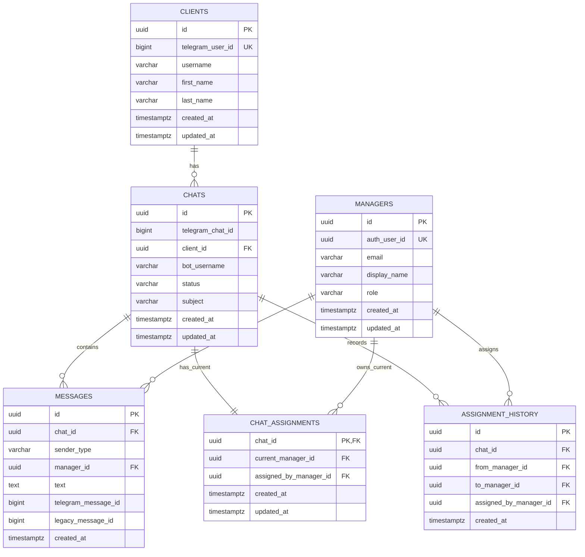

# ERD — Support Domain Relational Model

## Purpose

This document visualizes the target relational model for the support-domain learning stage.

It reflects the current decisions from:
- `docs/plan/plan.md`

## Mermaid ERD

## Notes

- `chat` is the central support-processing entity.
- `chat_assignments` stores only the current owner of the chat.
- `assignment_history` stores every reassignment event.
- `messages` stores message content, while `chats` stores workflow state.
- `bot_username` is stored on `chats` and is immutable per chat.
