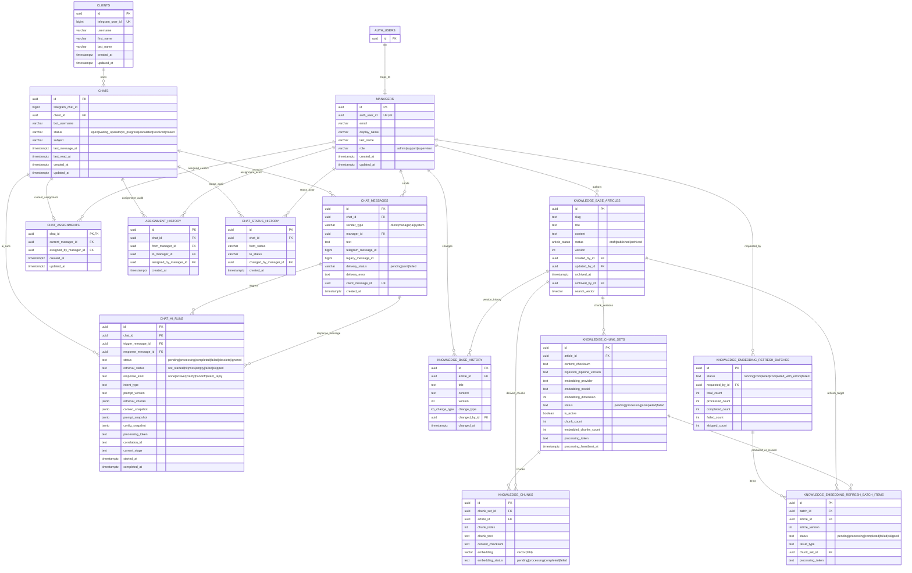

# ERD — текущая relational-архитектура SupportBot

Документ отражает фактическую схему проекта по миграциям на 2026-05-14.

Scope:

- support/chat domain;
- manager/admin domain;
- AI run/RAG domain;
- Knowledge Base domain;
- ingestion и embeddings refresh domain;
- read model boundaries.

Legacy table `messages` остается историческим артефактом ранней стадии и не является текущим support-domain message flow. Текущий message stream — `chat_messages`.

## Ownership boundaries

- `clients`, `chats`, `chat_messages`, `chat_assignments`, `assignment_history`, `chat_status_history` — support domain.
- `managers` — admin/manager domain, связанный с `auth.users`.
- `chat_ai_runs` — backend-only AI execution/audit domain.
- `knowledge_base_articles`, `knowledge_base_history`, `knowledge_chunk_sets`, `knowledge_chunks` — Knowledge Base и retrieval domain.
- `knowledge_embedding_refresh_batches`, `knowledge_embedding_refresh_batch_items` — async batch refresh domain.
- `support_admin_chat_inbox_summary`, `support_admin_bot_stats`, `get_support_admin_chat_inbox_page` — read model boundary, не владелец workflow state.

## Mermaid ERD

```mermaid
erDiagram
    AUTH_USERS ||--o| MANAGERS : maps_to
    CLIENTS ||--o{ CHATS : owns
    CHATS ||--o{ CHAT_MESSAGES : contains
    CHATS ||--o| CHAT_ASSIGNMENTS : current_assignment
    CHATS ||--o{ ASSIGNMENT_HISTORY : assignment_audit
    CHATS ||--o{ CHAT_STATUS_HISTORY : status_audit
    MANAGERS ||--o{ CHAT_MESSAGES : sends
    MANAGERS ||--o{ CHAT_ASSIGNMENTS : assigned_current
    MANAGERS ||--o{ ASSIGNMENT_HISTORY : assignment_actor
    MANAGERS ||--o{ CHAT_STATUS_HISTORY : status_actor
    CHATS ||--o{ CHAT_AI_RUNS : ai_runs
    CHAT_MESSAGES ||--o{ CHAT_AI_RUNS : triggers
    CHAT_MESSAGES ||--o{ CHAT_AI_RUNS : response_message
    MANAGERS ||--o{ KNOWLEDGE_BASE_ARTICLES : authors
    MANAGERS ||--o{ KNOWLEDGE_BASE_HISTORY : changes
    KNOWLEDGE_BASE_ARTICLES ||--o{ KNOWLEDGE_BASE_HISTORY : version_history
    KNOWLEDGE_BASE_ARTICLES ||--o{ KNOWLEDGE_CHUNK_SETS : chunk_versions
    KNOWLEDGE_CHUNK_SETS ||--o{ KNOWLEDGE_CHUNKS : chunks
    KNOWLEDGE_BASE_ARTICLES ||--o{ KNOWLEDGE_CHUNKS : derived_chunks
    MANAGERS ||--o{ KNOWLEDGE_EMBEDDING_REFRESH_BATCHES : requested_by
    KNOWLEDGE_EMBEDDING_REFRESH_BATCHES ||--o{ KNOWLEDGE_EMBEDDING_REFRESH_BATCH_ITEMS : items
    KNOWLEDGE_BASE_ARTICLES ||--o{ KNOWLEDGE_EMBEDDING_REFRESH_BATCH_ITEMS : refresh_target
    KNOWLEDGE_CHUNK_SETS ||--o{ KNOWLEDGE_EMBEDDING_REFRESH_BATCH_ITEMS : produced_or_reused

    AUTH_USERS {
        uuid id PK
    }

    CLIENTS {
        uuid id PK
        bigint telegram_user_id UK
        varchar username
        varchar first_name
        varchar last_name
        timestamptz created_at
        timestamptz updated_at
    }

    MANAGERS {
        uuid id PK
        uuid auth_user_id UK,FK
        varchar email
        varchar display_name
        varchar last_name
        varchar role "admin|support|supervisor"
        timestamptz created_at
        timestamptz updated_at
    }

    CHATS {
        uuid id PK
        bigint telegram_chat_id
        uuid client_id FK
        varchar bot_username
        varchar status "open|waiting_operator|in_progress|escalated|resolved|closed"
        varchar subject
        timestamptz last_message_at
        timestamptz last_read_at
        timestamptz created_at
        timestamptz updated_at
    }

    CHAT_MESSAGES {
        uuid id PK
        uuid chat_id FK
        varchar sender_type "client|manager|ai|system"
        uuid manager_id FK
        text text
        bigint telegram_message_id
        bigint legacy_message_id
        varchar delivery_status "pending|sent|failed"
        text delivery_error
        uuid client_message_id UK
        timestamptz created_at
    }

    CHAT_ASSIGNMENTS {
        uuid chat_id PK,FK
        uuid current_manager_id FK
        uuid assigned_by_manager_id FK
        timestamptz created_at
        timestamptz updated_at
    }

    ASSIGNMENT_HISTORY {
        uuid id PK
        uuid chat_id FK
        uuid from_manager_id FK
        uuid to_manager_id FK
        uuid assigned_by_manager_id FK
        timestamptz created_at
    }

    CHAT_STATUS_HISTORY {
        uuid id PK
        uuid chat_id FK
        varchar from_status
        varchar to_status
        uuid changed_by_manager_id FK
        timestamptz created_at
    }

    CHAT_AI_RUNS {
        uuid id PK
        uuid chat_id FK
        uuid trigger_message_id FK
        uuid response_message_id FK
        text status "pending|processing|completed|failed|obsolete|ignored"
        text retrieval_status "not_started|hit|miss|empty|failed|skipped"
        text response_kind "none|answer|clarify|handoff|intent_reply"
        text intent_type
        text prompt_version
        jsonb retrieval_chunks
        jsonb context_snapshot
        jsonb prompt_snapshot
        jsonb config_snapshot
        text processing_token
        text correlation_id
        text current_stage
        timestamptz started_at
        timestamptz completed_at
    }

    KNOWLEDGE_BASE_ARTICLES {
        uuid id PK
        text slug
        text title
        text content
        article_status status "draft|published|archived"
        int version
        uuid created_by_id FK
        uuid updated_by_id FK
        timestamptz archived_at
        uuid archived_by_id FK
        tsvector search_vector
    }

    KNOWLEDGE_BASE_HISTORY {
        uuid id PK
        uuid article_id FK
        text title
        text content
        int version
        kb_change_type change_type
        uuid changed_by_id FK
        timestamptz changed_at
    }

    KNOWLEDGE_CHUNK_SETS {
        uuid id PK
        uuid article_id FK
        text content_checksum
        text ingestion_pipeline_version
        text embedding_provider
        text embedding_model
        int embedding_dimension
        text status "pending|processing|completed|failed"
        boolean is_active
        int chunk_count
        int embedded_chunks_count
        text processing_token
        timestamptz processing_heartbeat_at
    }

    KNOWLEDGE_CHUNKS {
        uuid id PK
        uuid chunk_set_id FK
        uuid article_id FK
        int chunk_index
        text chunk_text
        text content_checksum
        vector embedding "vector(384)"
        text embedding_status "pending|processing|completed|failed"
    }

    KNOWLEDGE_EMBEDDING_REFRESH_BATCHES {
        uuid id PK
        text status "running|completed|completed_with_errors|failed"
        uuid requested_by_id FK
        int total_count
        int processed_count
        int completed_count
        int failed_count
        int skipped_count
    }

    KNOWLEDGE_EMBEDDING_REFRESH_BATCH_ITEMS {
        uuid id PK
        uuid batch_id FK
        uuid article_id FK
        int article_version
        text status "pending|processing|completed|failed|skipped"
        text result_type
        uuid chunk_set_id FK
        text processing_token
    }
```

## Критические constraints

- `clients.telegram_user_id` уникален.
- `managers.auth_user_id` уникален и ссылается на `auth.users`.
- `chats` уникальны по `(telegram_chat_id, bot_username)`.
- `chats.status` включает `waiting_operator` для AI handoff/human takeover.
- `chat_messages.sender_type` поддерживает `client`, `manager`, `ai`, `system`.
- `chat_messages.manager_id` обязателен только для `sender_type='manager'`.
- `chat_ai_runs` имеет один run на `(chat_id, trigger_message_id)` и один active pending/processing run на chat.
- `knowledge_chunk_sets` имеет один active completed set на article.
- `knowledge_chunks.embedding` имеет тип `vector(384)`.
- `knowledge_embedding_refresh_batches` допускает только один running batch через partial unique index.

## Read models

Read model objects:

- `support_admin_chat_inbox_summary`
- `support_admin_bot_stats`
- `get_support_admin_chat_inbox_page`

Они не являются источником workflow state. Они агрегируют `chats`, `clients`, `chat_assignments`, `managers` и `chat_messages` для pagination и header stats в support-admin.
